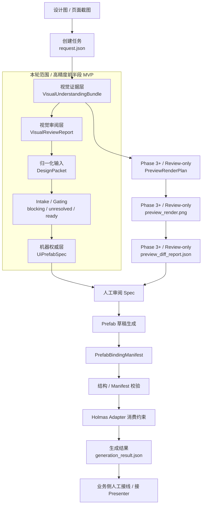
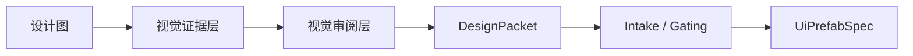
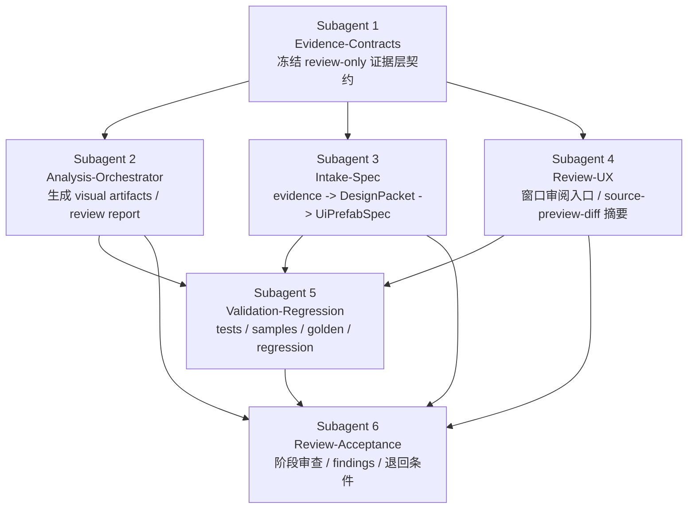

# Holmas 高精度 UI 识别与重建流程图

这页固定展示 Holmas 高精度 UI 识别与重建方案的 Mermaid 正文版流程图。

用途固定为：

- 让阅读者快速看懂从设计图到最终 prefab 的完整链路
- 明确当前轮次实际要做的是哪一段
- 说明高精度前半段 MVP 的 `6 个 subagent` 阶段性编组

## 审查结论

在将流程图固化为长期文档前，已按 `Agent 6 / Review-Acceptance` 口径补过一轮审查。  
审查后的冻结约束如下：

- 本图中的 `6 个 subagent` 仅表示“高精度前半段 MVP”的阶段性编组，不替代 [03_Agent编组方案](./03_Agent编组方案.md) 中的长期固定编组。
- 端到端主链必须显式包含 `intake / gating`，不能把 `DesignPacket -> UiPrefabSpec` 画成无门禁直通。
- `preview` 支线必须标注为 `Phase 3+ / review-only`，避免被误解成首轮必交付。
- 后半段必须显式拆成 `generation -> PrefabBindingManifest -> validation -> generation_result`，不能把“生成 + 校验”折叠成黑盒。

## 图例

- 主生成链：从设计图进入 `UiPrefabSpec` 再到 prefab 和 manifest 的正式链路
- review-only 支线：只用于审阅和验收，不直接驱动 generator
- 本轮范围：当前收缩版 MVP 重点增强的前半段
- Phase 3+：后续阶段，不要求首轮一次性实现

## 端到端总流程图

## 当前轮次在做哪一段

当前轮次不重做整条链，而是集中增强最薄弱的前半段：

这段增强完成后，现有的后半段仍沿用当前系统已有能力：

- `UiPrefabSpec -> prefab 草稿`
- `PrefabBindingManifest`
- validation
- `generation_result.json`
- Holmas adapter 消费约束

## 高精度前半段 MVP 的 6 个 Subagent 分工流程图

注意：这张图只适用于高精度前半段 MVP 的阶段性执行编组。  
它不替代 [03_Agent编组方案](./03_Agent编组方案.md) 中冻结的长期固定编组。

## 各 Subagent 的写入边界摘要

### Subagent 1 / Evidence-Contracts

- 只冻结 `VisualUnderstandingBundle`、`VisualReviewReport`、`PreviewRenderPlan`、`PreviewDiffReport`
- 只写 `Runtime/Core/Schema`、`Runtime/Core/Result` 和长期文档

### Subagent 2 / Analysis-Orchestrator

- 只负责 `Editor/Analysis` 和 task artifact 回写
- 不定义机器权威 spec 规则

### Subagent 3 / Intake-Spec

- 只负责 `Runtime/Core/Intake`
- 只做 evidence -> DesignPacket -> `UiPrefabSpec`

### Subagent 4 / Review-UX

- 只负责 `Editor/Window` 和 `Editor/Preview`
- 只读证据和 plan，不反向定义契约

### Subagent 5 / Validation-Regression

- 只负责 `Tests`、`Samples~/Holmas`、必要的 `Editor/Validation`
- 不临时改主实现来“修绿”测试

### Subagent 6 / Review-Acceptance

- 只负责 `doc/迭代记录`
- 不改长期主文档正文和生产实现目录

## 阶段映射

固定映射如下：

- `Phase 1`：evidence MVP
- `Phase 2`：intake / spec upgrade
- `Phase 3`：structured preview
- `Phase 4+`：真实 provider、逐元素人工纠正 UI

## 与现有系统关系

- 后半段 `generator / manifest / validation / Holmas adapter` 仍按现有系统执行
- 本轮主要增强前半段输入质量和可审阅性
- `UiPrefabSpec` 仍是唯一机器权威
- preview 支线始终是 `review-only`，不直接驱动 generator

## 完成情况

- 已固定端到端总流程图
- 已固定“当前轮次范围”流程图
- 已固定高精度前半段 MVP 的 `6 个 subagent` 阶段性编组流程图
- 已补充与长期固定编组、当前轮次范围、preview 阶段边界的说明
