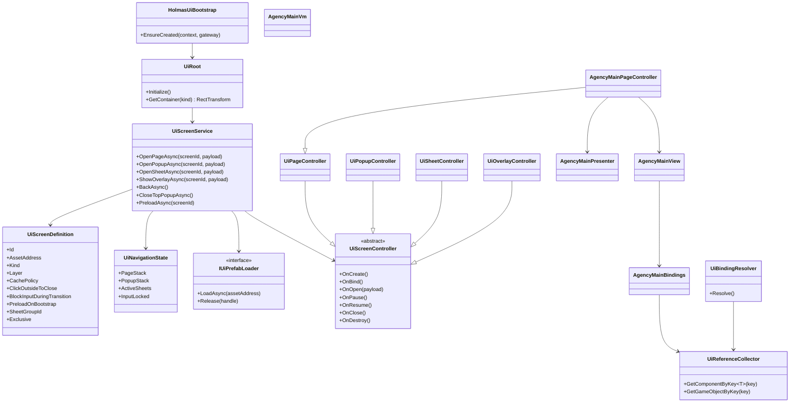

# Holmas 业务侧 UI 框架最小落地方案

## 文档定位

这份文档描述的是 Holmas 业务侧 UI 的最小正式框架 v2。  
它服务于以下主线：

- `YooAssets`
- `HybridCLR`
- 小游戏体量的正式业务 UI
- `UiPrefabSpec -> prefab 草稿 + PrefabBindingManifest` 接入链路

这不是 UI 自动生成系统本体规则，也不是 gameplay 方案文档。  
它只回答一件事：

- Holmas 业务侧应该怎样设计一套稳定、简单、好维护、能消费自动生成结果的自研 UI 框架

## 完成情况

- 当前状态：进行中
- 进度说明：`App.HotUpdate/Holmas/UI` 已落下 v2 第一批最小代码骨架，完成 `Bootstrap / Core / Binding / Screens/AgencyMain` 目录与首批核心类型，`HolmasUiBootstrap` 已改为指向新 `UiRoot`
- 已完成：
  - `UiRoot / UiScreenService / UiScreenDefinition / UiNavigationState / IUiPrefabLoader / UiLoadedPrefabHandle`
  - `UiScreenController` 及 `Page / Popup / Sheet / Overlay` 语义化派生层
  - `UiBindingEntry / UiReferenceCollector / UiBindingResolver`
  - `AgencyMainPageController / Presenter / View / Bindings / Vm`
  - 旧 `HolmasUiRoot` 已标注为过渡态保留
- 未完成：
  - 正式 prefab 地址、manifest 数据源与生成结果接入
  - popup / sheet / overlay 的真实业务页面样例
  - 转场动画、点击空白关闭、复杂缓存与对象池
  - 更完整的运行时验证与 UI 资产联调

## 冻结目标与非目标

### 目标

- 保持纯自研，不引入第三方运行时 UI 导航框架
- 吸收 `UnityScreenNavigator` 在导航模型上的优点
- 继续沿用 `YooAssets + HybridCLR + UGUI prefab + PrefabBindingManifest`
- 保持自动生成系统与业务 UI 的接缝稳定
- 保持 UI 只做表现、交互转发和页面编排
- 让后续实现能按低冲突目录和 subagent 独占写入推进

### 非目标

- 不在业务 UI 框架里定义生成器核心 schema
- 不在业务 UI 框架里承载 gameplay 规则
- 不把自动生成系统和 Holmas 业务目录混写
- 不继续沿用旧 Lua 事件桥和字符串事件总线
- 不在首版最小方案里冻结复杂转场系统、对象池和动画编排框架
- 不要求 prefab 根节点挂第三方页面组件

## 约束来源

这版方案同时遵循以下约束：

- `unity-hotupdate-boundary`
  - `App.AOT` 只放宿主、资源、持久化、HybridCLR 和平台基础设施
  - `App.HotUpdate` 承载正式业务 UI 控制器、Presenter 和页面行为
  - `App.Shared` 只放最小稳定接口和 DTO
  - 正式运行时 prefab 通过 YooAssets 加载，不新增 `Resources.Load` 正式链路

- `unity-ugui-flow-integration`
  - Presenter 和 Controller 只消费 runtime state，不承载玩法规则
  - `MonoBehaviour` 只做绑定、渲染、动画和输入转发
  - 同一页面的刷新必须幂等

- `ui-prefab-governance`
  - 生成器系统权威正文继续留在 `doc/长期主文档/UI自动生成系统`
  - Holmas 只通过 adapter 和业务侧消费层接入
  - 目录必须按高冲突区独占写入

## 从 UnityScreenNavigator 吸收的设计点

这版只吸收 `UnityScreenNavigator` 真正适合 Holmas 的导航思想，不吸收其第三方运行时依赖。

### 采纳的设计点

- `Page / Popup / Sheet / Overlay` 分类
- 页面历史栈和返回语义
- 明确统一的页面生命周期
- 资源加载抽象
- 预加载能力
- 转场期间输入阻断

### 不采纳的设计点

- 不引第三方包
- 不要求 prefab 根节点挂页面组件基类
- 不让自动生成系统产出导航框架逻辑
- 不把复杂转场系统冻结到首版最小方案
- 不引入额外 GUI 库、状态机库或全局事件总线

## 核心运行时结构

这版框架固定为“导航型轻框架”，核心由以下类型组成：

### `UiRoot`

常驻根节点，只负责：

- 创建 `Canvas`
- 创建四类 UI 容器
- 持有 `UiScreenService`
- 持有全局输入阻断层

固定 4 类容器：

- `Page`
- `Popup`
- `Sheet`
- `Overlay`

`UiRoot` 是宿主与业务 UI 的总入口，不承载页面业务逻辑。

### `UiScreenService`

负责：

- 页面打开关闭
- 历史栈管理
- popup 栈管理
- sheet 组切换
- overlay 显隐
- prefab 加载和实例生命周期
- 转场期间输入锁
- 首版预加载

固定对外 API：

- `OpenPageAsync(screenId, payload = null)`
- `OpenPopupAsync(screenId, payload = null)`
- `OpenSheetAsync(screenId, payload = null)`
- `ShowOverlayAsync(screenId, payload = null)`
- `BackAsync()`
- `CloseTopPopupAsync()`
- `CloseAsync(screenId)`
- `PreloadAsync(screenId)`
- `IsOpen(screenId)`

### `UiScreenDefinition`

每个界面一份静态配置，固定字段为：

- `Id`
- `AssetAddress`
- `Kind`
- `Layer`
- `CachePolicy`
- `ClickOutsideToClose`
- `BlockInputDuringTransition`
- `PreloadOnBootstrap`
- `SheetGroupId`
- `Exclusive`

### `UiNavigationState`

负责维护运行时导航状态：

- `Page` 历史栈
- `Popup` 栈
- 每个 `SheetGroupId` 当前激活项
- 全局输入锁状态

### `IUiPrefabLoader`

固定作为 YooAssets 的资源加载抽象层。  
`UiScreenService` 只依赖该接口，不直接依赖 YooAssets API。

建议接口：

```csharp
public interface IUiPrefabLoader
{
    Task<UiLoadedPrefabHandle> LoadAsync(string assetAddress);
    void Release(UiLoadedPrefabHandle handle);
}
```

### `UiLoadedPrefabHandle`

负责封装：

- prefab 资源句柄
- 实例根节点
- 释放入口

### `UiScreenController`

所有正式页面控制器的抽象基类。  
它只负责：

- 生命周期
- 事件接线
- 调应用服务
- 调 Presenter
- 驱动 View 刷新

它不负责：

- 地图生成
- 任务生成
- 奖励结算
- 存档规则

### 语义化派生控制器

固定保留 4 类语义化派生层：

- `UiPageController`
- `UiPopupController`
- `UiSheetController`
- `UiOverlayController`

这 4 类只表达页面语义，不要求 prefab 根节点挂额外组件。

## 屏幕分类与生命周期

### `UiScreenKind`

固定为：

- `Page`
- `Popup`
- `Sheet`
- `Overlay`

### 分类行为语义

`Page`

- 主流程页面
- 打开新页面时旧页面进入暂停态
- 进入页面历史栈
- 支持 `BackAsync()`

`Popup`

- 模态弹窗
- 进入 popup 栈
- 不进入 page 历史栈
- 支持点击空白关闭

`Sheet`

- 同页切换容器
- 用于页签、子面板、二级切换
- 不进入 page 历史栈
- 必须声明 `SheetGroupId`

`Overlay`

- loading、toast、引导遮罩、全局提示层
- 不进入任何导航栈

### 统一生命周期

控制器生命周期固定为：

- `OnCreate`
- `OnBind`
- `OnOpen`
- `OnPause`
- `OnResume`
- `OnClose`
- `OnDestroy`

### 生命周期规则

`OnCreate`

- prefab 实例创建后只执行一次
- 只做一次性依赖初始化

`OnBind`

- 通过 `UiReferenceCollector` 解析引用
- 完成静态事件绑定
- 只执行一次

`OnOpen`

- 每次页面展示时执行
- 读取 payload
- 刷新首帧 UI

`OnPause`

- 当前 `Page` 被新 `Page` 覆盖时执行

`OnResume`

- 从历史栈返回当前页面时执行

`OnClose`

- 每次关闭时执行
- 可停止异步任务、解绑临时订阅

`OnDestroy`

- 实例真正销毁时执行

## 导航、历史栈与输入锁规则

### Page 规则

- `Page` 打开时入 page 历史栈
- 新 `Page` 打开时，旧 `Page` 触发 `OnPause`
- `BackAsync()` 时，顶部 `Page` 关闭，上一页触发 `OnResume`

### Popup 规则

- `Popup` 进入独立 popup 栈
- 默认阻断下层交互
- `ClickOutsideToClose = true` 时，点击遮罩可关闭
- 关闭 popup 不影响 page 历史栈

### Sheet 规则

- `Sheet` 只在同一 `SheetGroupId` 内切换
- 同组切换时，替换当前活动项
- 不影响 page 历史栈

### Overlay 规则

- `Overlay` 不进入任何导航栈
- 由调用者决定显隐时机
- 适合 loading、toast、引导遮罩

### 输入锁规则

- `BlockInputDuringTransition = true` 时，页面打开关闭期间启用全局输入阻断
- `Popup` 默认阻断下层交互
- `Page` 默认在切换期间阻断交互
- `Overlay` 是否阻断交互由定义决定

## 资源加载、缓存与预加载策略

### 资源加载抽象

正式运行时 prefab 统一通过 `IUiPrefabLoader` 加载。  
默认实现走 YooAssets。

业务页面禁止：

- 直接调用 `Resources.Load`
- 直接在控制器中依赖 YooAssets 细节 API

### `UiCachePolicy`

固定为：

- `DestroyOnClose`
- `KeepInstance`
- `PreloadOnly`

默认建议：

- `Page`：`DestroyOnClose`
- 常驻型主界面或高频界面：`KeepInstance`
- 首版启动即需要的界面：`PreloadOnly` 或 `PreloadOnBootstrap = true`

### 预加载策略

首版只支持“prefab 级预加载”，不做复杂对象池。

固定支持：

- `PreloadAsync(screenId)`
- `PreloadOnBootstrap`

不在首版冻结：

- 控件池
- 动态子节点对象池
- 转场资源分组预热策略

## 自动生成接缝与绑定消费层

Holmas 业务侧固定沿用以下消费链：

1. 自动生成系统产出 `UiPrefabSpec`
2. 生成器根据 spec 产出普通 UGUI prefab 草稿和 `PrefabBindingManifest`
3. Holmas adapter 只做目录和 manifest 归一化
4. 业务侧通过 `UiReferenceCollector + UiBindingResolver` 消费生成结果
5. `UiScreenController` 负责事件接线
6. `Presenter` 负责产出 ViewModel
7. `View` 负责幂等渲染

### 绑定消费层类型

`UiBindingEntry`

- 表达单个绑定项
- 持有：
  - `binding_key`
  - `component_type`
  - `node_path`
  - `event_name`

`UiReferenceCollector`

- 挂在 prefab 根或页面根
- 只保存显式引用表
- 不承担业务逻辑

`UiBindingResolver`

- 负责把 collector 与 manifest 映射成业务侧 `Bindings`
- 不参与页面导航逻辑

`Bindings.Resolve()`

- 每个页面本地静态解析入口
- 只负责把当前页面需要的组件解析为强类型字段

### 绑定主键规则

业务侧优先以 `binding_key` 做绑定主键。

- `binding_key`
  - 正式绑定主键
- `event_name`
  - 事件出口映射
- `node_path`
  - 调试、排查和校验辅助键

### 生成系统边界

自动生成系统不负责：

- 生成 gameplay 逻辑
- 生成正式 Presenter
- 生成页面导航框架逻辑
- 让 prefab 强依赖第三方页面基类

Holmas 业务侧不负责：

- 改写核心 schema
- 把任务目录当运行时依赖

运行时优先消费：

- 最终 prefab
- 最终 manifest

## 最小目录方案

业务侧 UI 正式目录固定为：

```text
Assets/HotUpdateContent/Script/App.HotUpdate/Holmas/UI
├── Bootstrap
├── Core
├── Binding
├── Screens
│   ├── AgencyMain
│   ├── CommonPopup
│   └── SharedSheets
└── Widgets
```

### Bootstrap

- `HolmasUiBootstrap`

### Core

- `UiRoot`
- `UiScreenKind`
- `UiLayerId`
- `UiCachePolicy`
- `UiScreenDefinition`
- `UiNavigationState`
- `IUiPrefabLoader`
- `UiLoadedPrefabHandle`
- `UiScreenService`
- `UiScreenController`
- `UiPageController`
- `UiPopupController`
- `UiSheetController`
- `UiOverlayController`

### Binding

- `UiBindingEntry`
- `UiReferenceCollector`
- `UiBindingResolver`

### Screens

- 页面级 `Controller`
- `Presenter`
- `Bindings`
- `View`
- `Vm`

### Widgets

- 可复用条目视图
- 与具体页面解耦的小型视图组件

### 目录说明

- 现有 `HolmasUiRoot` 只是过渡态参考，不作为正式方案结构
- `Tool/Tmp` 是历史迁移残留，不属于新框架核心
- `Core`
- `Binding`
- `Screens/AgencyMain`
  这 3 类属于高冲突目录，后续实现必须独占写入

## 首屏模板与迁移路径

首屏固定建议采用 `AgencyMain`，因为它能覆盖小游戏常见的正式 UI 要求：

- 概览文本
- 任务栏
- 主按钮操作
- 简单列表
- 棋盘或主内容区域

### 首屏最小模板

- `AgencyMainPageController`
- `AgencyMainPresenter`
- `AgencyMainView`
- `AgencyMainBindings`
- `AgencyMainVm`

### 建议职责

`AgencyMainPageController`

- 继承 `UiPageController`
- 负责首屏按钮事件
- 负责导航调用
- 负责刷新触发

`AgencyMainPresenter`

- 从 `HolmasApplicationContext` 和相关服务读取状态
- 产出 `AgencyMainVm`

`AgencyMainView`

- 只做 `Render(vm)`
- 不参与业务决策

`AgencyMainBindings`

- 从 `UiReferenceCollector` 解析 `binding_key`
- 持有页面实际组件引用

`AgencyMainVm`

- 只承载渲染所需数据

### 示例页面语义

建议在文档中固定两个补充示例：

- `TaskDetailPopupController`
  - 作为 `Popup` 示例

- `AgencyTabSheetController`
  - 作为 `Sheet` 示例

### 现有过渡态的迁移说明

保留以下思路：

- 继续使用现有 `HolmasUiBootstrap` 作为入口方向
- 继续保留现有 `HolmasUiPresenter` 的状态汇总思路

不保留以下结构：

- 现有 `HolmasUiRoot` 里“纯代码拼 UI”的正式结构

迁移顺序建议：

1. 保留入口
2. 抽出 `UiRoot`
3. 引入 `UiScreenService`
4. 让 `AgencyMain` 改为 prefab + binding + controller 方案
5. 再逐步扩展 popup 和 sheet

## Subagent 执行规划

### 推荐数量

推荐 **5 个 subagent**：

- `4 个执行 subagent`
- `1 个审查 subagent`

不推荐少于 5 个，也不推荐 6 个以上。

原因：

- 少于 5 个：
  - `Core`
  - `Binding`
  - 首屏模板
  - review
  会混在一起
  - 高冲突目录过多
  - 边界不容易冻结

- 多于 5 个：
  - 这次不是生成器本体孵化
  - 也不是大规模全 UI 并行开发
  - 会增加等待链和协调成本
  - `App.HotUpdate/Holmas/UI` 本身属于高冲突区，不适合切太碎

### Subagent 1 / Navigation-Core

技能组合：

- `unity-hotupdate-boundary`
- `unity-ugui-flow-integration`

职责：

- 冻结 `UiRoot / UiScreenService / UiScreenDefinition / UiNavigationState`
- 冻结 `UiScreenKind / UiCachePolicy / IUiPrefabLoader`
- 定义导航栈、返回规则、输入锁规则
- 产出本文档中的“核心运行时结构”和“导航规则”章节

允许写入范围：

- `App.HotUpdate/Holmas/UI/Core`
- 本文档中与核心运行时相关章节

禁止写入范围：

- `Binding`
- `Screens/AgencyMain`
- 自动生成系统核心目录
- `App.Shared`

交付物：

- 核心类型清单
- 生命周期说明
- 页面栈与输入锁规则
- 核心结构图

### Subagent 2 / Binding-Manifest-Consumption

技能组合：

- `ui-prefab-governance`
- `unity-hotupdate-boundary`
- `unity-ugui-flow-integration`

职责：

- 冻结 `UiReferenceCollector / UiBindingEntry / UiBindingResolver`
- 定义业务侧如何消费 `PrefabBindingManifest`
- 明确 `binding_key / event_name / node_path` 的使用顺序
- 产出本文档中的“自动生成接缝与绑定消费层”章节

允许写入范围：

- `App.HotUpdate/Holmas/UI/Binding`
- 本文档中绑定和接缝章节
- 如确有必要，仅补 Holmas 接入约束中的引用说明

禁止写入范围：

- `Assets/Tools/UiPrefabGenerator/Runtime/Core/*`
- `Screens/AgencyMain`
- `App.Shared`

交付物：

- 绑定消费层类型说明
- manifest 消费链路
- 手工接线与自动生成职责边界

### Subagent 3 / Screen-Lifecycle-Flow

技能组合：

- `unity-hotupdate-boundary`
- `unity-ugui-flow-integration`

职责：

- 冻结 `UiPageController / UiPopupController / UiSheetController / UiOverlayController`
- 冻结屏幕分类行为语义
- 明确 `OnCreate / OnBind / OnOpen / OnPause / OnResume / OnClose / OnDestroy`
- 产出本文档中的“屏幕分类与生命周期”章节

允许写入范围：

- `App.HotUpdate/Holmas/UI/Core`
- 本文档中屏幕行为与生命周期章节

禁止写入范围：

- `Binding`
- `Screens/AgencyMain`
- 自动生成系统目录

交付物：

- 控制器派生层说明
- 生命周期矩阵
- `Page / Popup / Sheet / Overlay` 的打开关闭规则

### Subagent 4 / AgencyMain-Sample-Migration

技能组合：

- `unity-hotupdate-boundary`
- `unity-ugui-flow-integration`

职责：

- 定义最小首屏模板
- 将现有 `HolmasUiBootstrap` 和 `HolmasUiPresenter` 作为迁移起点纳入文档
- 设计 `AgencyMainPageController + Presenter + View + Bindings + Vm`
- 定义一个 `Popup` 示例和一个 `Sheet` 示例
- 产出本文档中的“首屏模板与迁移路径”章节

允许写入范围：

- `App.HotUpdate/Holmas/UI/Bootstrap`
- `App.HotUpdate/Holmas/UI/Screens`
- 本文档中首屏与迁移章节

禁止写入范围：

- `Binding`
- 生成器目录
- `App.Shared`

交付物：

- 首屏模板结构
- 迁移说明
- 现有过渡态到正式框架的演进路径

### Subagent 5 / Review-Acceptance

技能组合：

- `ui-prefab-governance`
- `unity-hotupdate-boundary`
- 按审查对象叠加 `unity-ugui-flow-integration`

职责：

- 独立审查 v2 文档是否满足三套约束
- 审查 subagent 切分是否存在目录冲突或职责交叉
- 给出：
  - `通过`
  - `通过，但有非阻塞建议`
  - `未通过，退回修复`

允许写入范围：

- `doc/迭代记录`
- review note

禁止写入范围：

- 本文档正文
- `App.HotUpdate/Holmas/UI`
- 生成器目录正文

交付物：

- 审查结论
- findings 清单
- 复审条件

### 启动顺序

固定顺序为：

1. `Subagent 1 / Navigation-Core`
2. `Subagent 2 / Binding-Manifest-Consumption` 与 `Subagent 3 / Screen-Lifecycle-Flow` 并行
3. `Subagent 4 / AgencyMain-Sample-Migration` 在 1、2、3 结构冻结后介入
4. `Subagent 5 / Review-Acceptance` 在 v2 文档完整后介入

### 独占目录

以下区域后续实现必须独占写入：

- `Core`
- `Binding`
- `Screens/AgencyMain`
- 本文档正文
- `doc/迭代记录` 中的 review note

## 验收场景

后续实现至少覆盖以下场景：

- 新 `Page` 打开后，生命周期按 `OnCreate -> OnBind -> OnOpen` 执行
- 新 `Page` 覆盖旧 `Page` 时，旧页面进入 `OnPause`
- `BackAsync()` 后，上一页正确触发 `OnResume`
- `Popup` 打开时进入 popup 栈，不污染 page 历史
- `ClickOutsideToClose` 的 `Popup` 点击空白能关闭
- 同组 `Sheet` 切换不影响 page 栈
- `Overlay` 不进入任何导航栈
- `BlockInputDuringTransition` 为 true 时，转场期间不可误触
- manifest 中的 `binding_key / event_name / node_path` 能被业务侧稳定消费
- 业务侧控制器不直接依赖 `Resources.Load`
- 现有 `HolmasUiRoot` 能被清晰标注为过渡态，而不是正式方案核心
- 5 个 subagent 的目录边界不存在冲突

## 附：Mermaid 最小类图


