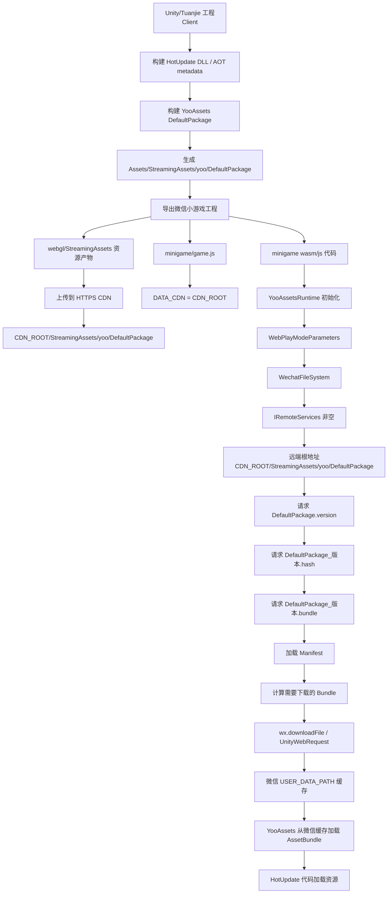

# Holmas 热更新本地验证流程

## 目标

本流程用于验证 Holmas 在本地热更模式下的最小闭环：

- `Assets/HotUpdateContent` 作为热更资源与热更代码内容根。
- YooAssets 构建 `DefaultPackage` 本地包，并能从包内加载配置、地图、UI prefab、字体、图标、HotUpdate DLL 与 AOT metadata。
- BootstrapScene 在 PlayMode/batchmode 下走 `GameBootstrap -> YooAssetsRuntime -> HybridClrLoader -> HotUpdateEntry -> HolmasGameBootstrap -> UI/runtime`。

当前阶段已接入 HybridCLR package/config 与 IL2CPP player smoke 脚本；严格 IL2CPP/player smoke 需要先保证工程无脚本编译错误，再确认 `HybridCLR/Installer...` 与目标平台 IL2CPP 环境。远端 CDN 与微信真机仍不在本地脚本覆盖范围内。

## 热更内容边界

运行时正式内容应放在 `Assets/HotUpdateContent` 下：

- 配置运行时产物：`Assets/HotUpdateContent/Config/*.bytes`
- 地图、图标、教程、UI prefab、字体：`Assets/HotUpdateContent/Res/**`
- 热更脚本源码：`Assets/HotUpdateContent/Script/App.HotUpdate/**`
- 测试期临时复制的 DLL/metadata 目标：`Assets/HotUpdateContent/Res/HotUpdate/**`

`Assets/Config/*.xlsx` 仍是编辑器源表，不作为运行时热更加载入口。

## HybridCLR 正式配置

项目已固定接入官方 HybridCLR package：

- `Packages/manifest.json`：`com.code-philosophy.hybridclr` -> `https://github.com/focus-creative-games/hybridclr_unity.git#v8.11.0`
- `ProjectSettings/HybridCLRSettings.asset`
  - `hotUpdateAssemblies`: `App.HotUpdate`
  - `patchAOTAssemblies`: `mscorlib`, `System`, `System.Core`, `UnityEngine.CoreModule`, `UnityEngine.UI`, `UnityEngine.UIModule`, `UnityEngine.TextRenderingModule`, `UnityEngine.JSONSerializeModule`, `UnityEngine.InputLegacyModule`, `Unity.TextMeshPro`, `App.Shared`
  - HotUpdate DLL 输出根：`HybridCLRData/HotUpdateDlls`
  - AOT metadata 输出根：`HybridCLRData/AssembliesPostIl2CppStrip`

Holmas 专用菜单：

- `Holmas/HotUpdate/Configure HybridCLR Settings`
- `Holmas/HotUpdate/Generate And Copy HybridCLR Assets`
- `Holmas/HotUpdate/Prepare Local Validation Assets`
- `Holmas/Validation/Build IL2CPP Player Smoke`

严格 HybridCLR 流程会执行 `HybridCLR/Generate/All`，再把：

- `HybridCLRData/HotUpdateDlls/{BuildTarget}/App.HotUpdate.dll`
- `HybridCLRData/AssembliesPostIl2CppStrip/{BuildTarget}/{AOT}.dll`

复制到：

- `Assets/HotUpdateContent/Res/HotUpdate/App.HotUpdate.dll.bytes`
- `Assets/HotUpdateContent/Res/HotUpdate/Metadata/*.dll.bytes`

这些 DLL、metadata、YooAssets buildin 包、player 输出都视为本地构建产物，不提交。`.gitignore` 已忽略 `HybridCLRData/`、`HybridCLRGenerate/`、`Assets/StreamingAssets/yoo/`。

## 一键验证

优先使用新增热更专项脚本：

```bash
bash tools/validation/run_holmas_hotupdate_validation.sh
```

脚本会复制当前工程到 `/private/tmp` 临时目录，再在临时工程内执行：

1. `bash tools/validation/check_boundary.sh`
2. 调用 `HolmasHybridClrBuildPipeline.PrepareHotUpdateAssetsForLocalValidation`
   - 若 HybridCLR package 已安装且已完成 `HybridCLR/Installer...`，走严格 `HybridCLR/Generate/All` + 复制流程
   - 否则仅用于 Editor 本地包验证，回退复制 `Library/ScriptAssemblies` 中可用的 DLL/metadata
3. 准备 `Assets/HotUpdateContent/Res/HotUpdate/App.HotUpdate.dll.bytes` 与可用 AOT metadata `.bytes`
4. 配置 YooAssets collector：`Assets/HotUpdateContent/Config` 与 `Assets/HotUpdateContent/Res`
5. 构建 YooAssets `DefaultPackage` 到临时工程的 `Library/HolmasHotUpdate/YooBuild`
6. PlayMode 下用 OfflinePlayMode 从 `Library/HolmasHotUpdate/Buildin/DefaultPackage` 加载包内容
7. 执行 BootstrapScene PlayMode probe

验证通过后，脚本会删除本次创建的临时工程；失败时会保留临时工程和 `/tmp/holmas_hotupdate_validation_*` 日志。

## 基线验证

热更专项之外，仍需保证原有验证脚本语义不变：

```bash
bash tools/validation/check_boundary.sh
bash tools/validation/run_holmas_validation.sh
```

## IL2CPP Player Smoke

新增严格 player smoke 入口：

```bash
bash tools/validation/run_holmas_il2cpp_player_smoke.sh --build-target StandaloneOSX
```

脚本会复制工程到 `/private/tmp`，在临时工程中：

1. 要求 HybridCLR package 可用且已执行 `HybridCLR/Installer...`
2. 执行严格 HybridCLR 生成与复制流程
3. 构建 YooAssets `DefaultPackage` 到 `Assets/StreamingAssets/yoo/DefaultPackage`
4. 给 player 构建追加 `HOLMAS_YOO_OFFLINE_PLAYMODE`
5. 使用 IL2CPP 构建 standalone player
6. 启动 player，并在日志里等待 `HolmasGameBootstrap: Holmas 业务骨架已启动`、`HotUpdateEntry: Holmas 业务骨架接线完成` 或 `GameBootstrap: 初始化完成`

2026-04-30 本机尝试结果：

- `run_holmas_il2cpp_player_smoke.sh --build-target StandaloneOSX --keep-temp-on-success` 未进入 player 构建阶段。
- 失败点：临时工程已解析 HybridCLR package，但当前机器/工程尚未执行 `HybridCLR/Installer...`，严格生成报错 `HybridCLR has not been initialized. Run HybridCLR/Installer before strict generation or IL2CPP player smoke.`
- 下一步：在可写且允许初始化 HybridCLRData 的 Unity/Tuanjie 环境执行 `HybridCLR/Installer...`，再重跑 IL2CPP smoke；通过后再推进微信真机或 CDN 验证。

2026-05-05 本机尝试结果：

- AOT metadata 清单从基础 App.Shared 验链路扩展到当前热更代码真实使用的保守目标平台清单：`UnityEngine.UIModule`、`UnityEngine.TextRenderingModule`、`UnityEngine.JSONSerializeModule`、`UnityEngine.InputLegacyModule` 纳入必须产出和加载的 metadata；`Library/ScriptAssemblies` 回退仅用于 Editor/OfflinePlayMode 本地验证。
- `run_holmas_il2cpp_player_smoke.sh --build-target StandaloneOSX --log-prefix holmas_il2cpp_player_smoke_20260505_metadata` 未进入 HybridCLR 严格生成、YooAssets build 或 IL2CPP player 构建阶段。
- 失败点：临时工程脚本编译失败，`/tmp/holmas_il2cpp_player_smoke_20260505_metadata_build.log` 报 `Assets/HotUpdateContent/Script/App.HotUpdate/Holmas/UI/Screens/Leaderboard/LeaderboardView.cs(107,21): error CS0234`，当前未提交排行榜 UI 文件中 `Application.isPlaying` 被解析到 `App.HotUpdate.Holmas.Application` 命名空间。
- 同轮 `run_holmas_hotupdate_validation.sh` 的边界检查通过，但 batchmode 编译同样失败；日志为 `/tmp/holmas_hotupdate_validation_20260505_202538_yooassets_package.log`，临时工程保留在 `/private/tmp/holmas_hotupdate_validation_vL1oOp`。
- 下一步：先在 UI/排行榜主线修复或隔离该编译错误，再重跑热更专项验证和 IL2CPP player smoke；若编译通过后再出现失败，再按日志区分 `HybridCLR/Installer...`、目标平台 IL2CPP toolchain、metadata 缺失或 player 启动问题。

2026-05-05 23:08 复跑结果：

- `run_holmas_hotupdate_validation.sh --log-prefix holmas_hotupdate_validation_20260505_230845` 已通过：YooAssets 本地包、HotUpdate DLL/metadata 验证和 BootstrapScene PlayMode/batchmode probe 全部通过。
- 热更专项日志：`/tmp/holmas_hotupdate_validation_20260505_230845_yooassets_package.log`、`/tmp/holmas_hotupdate_validation_20260505_230845_playmode_probe.log`。
- `run_holmas_il2cpp_player_smoke.sh --build-target StandaloneOSX --log-prefix holmas_il2cpp_player_smoke_20260505_230845` 第一次失败在临时工程解析 HybridCLR Git package，错误为 Git RPC partial file/early EOF，日志：`/tmp/holmas_il2cpp_player_smoke_20260505_230845_build.log`。
- `run_holmas_il2cpp_player_smoke.sh --build-target StandaloneOSX --log-prefix holmas_il2cpp_player_smoke_20260505_230845_retry1` 重试后成功解析 HybridCLR package，但严格生成前检查失败：`HybridCLR has not been initialized. Run HybridCLR/Installer before strict generation or IL2CPP player smoke.` 日志：`/tmp/holmas_il2cpp_player_smoke_20260505_230845_retry1_build.log`，临时工程保留在 `/private/tmp/holmas_il2cpp_player_smoke_uG122x`。
- 当前最新失败层级：不是脚本编译、不是 AOT metadata 清单、不是 IL2CPP toolchain 或 player 启动；阻塞在本机/临时工程尚未完成 `HybridCLR/Installer...` 初始化。下一步需要在可复用或可初始化的 Tuanjie 环境完成 Installer，再重跑 IL2CPP smoke。

2026-05-06 本机 Installer 后复跑结果：

- Tuanjie 中 `HybridCLR/Installer...` 已执行成功，Installer 面板显示 `Installed: True`、`Installed Version: v8.11.0`；主工程产生本地 `HybridCLRData/LocalIl2CppData-OSXEditor`。
- 严格 HybridCLR 生成阶段会触发 Unity player script 编译，`com.unity.visualscripting` 依赖 `UnityEngine.AI`；项目已补 `Packages/manifest.json` 中的 `com.unity.modules.ai`，否则 `GenerateStripedAOTDlls` 会因 `UnityEngine.AI` 缺失失败。
- `run_holmas_hotupdate_validation.sh --log-prefix holmas_hotupdate_validation_20260506_000122_ai` 已通过：严格 HybridCLR 生成、YooAssets 本地包、HotUpdate DLL/metadata 验证和 BootstrapScene PlayMode/batchmode probe 全部通过。日志：`/tmp/holmas_hotupdate_validation_20260506_000122_ai_yooassets_package.log`、`/tmp/holmas_hotupdate_validation_20260506_000122_ai_playmode_probe.log`。
- `run_holmas_il2cpp_player_smoke.sh` 需要把 `HybridCLRData` 带入临时工程，否则临时工程会重新显示未初始化；脚本已改为不再排除 `HybridCLRData`，这些仍是本地临时构建产物，不提交。
- `run_holmas_il2cpp_player_smoke.sh --build-target StandaloneOSX --log-prefix holmas_il2cpp_player_smoke_20260506_000122_ai_hybridclrdata` 已越过 Installer 检查、HotUpdate DLL 编译、link.xml 生成和 stripped AOT 前置流程；当前失败点为 Tuanjie StandaloneOSX IL2CPP player 模块缺失，日志报 `Currently selected scripting backend (IL2CPP) is not installed.` 日志：`/tmp/holmas_il2cpp_player_smoke_20260506_000122_ai_hybridclrdata_build.log`，临时工程保留在 `/private/tmp/holmas_il2cpp_player_smoke_smGPXO`。
- 本机 `/Applications/Tuanjie/Hub/Editor/2022.3.62t2/Tuanjie.app/Contents/PlaybackEngines/MacStandaloneSupport/Variations` 仅发现 mono player 变体，未发现 StandaloneOSX IL2CPP player 变体。下一步需要通过 Tuanjie Hub 为当前编辑器安装 StandaloneOSX IL2CPP 支持，或改用已安装 IL2CPP 支持的目标平台继续 smoke。

2026-05-06 StandaloneOSX IL2CPP 模块安装后复跑结果：

- Tuanjie Hub 安装 `Mac Build Support (IL2CPP)` 后，当前编辑器已出现 StandaloneOSX IL2CPP player 变体：`macos_arm64_player_*_il2cpp`、`macos_x64_player_*_il2cpp`、`macos_x64arm64_player_*_il2cpp`。
- 首轮 `run_holmas_il2cpp_player_smoke.sh --build-target StandaloneOSX --log-prefix holmas_il2cpp_player_smoke_20260506_004254` 已进入严格 HybridCLR/YooAssets 流程，但构建输出放在临时工程 `Library/` 下，被 Unity/Tuanjie 拒绝：`Invalid build path ... The 'Library' directory is an internal work directory of Unity`。脚本已改为把 player 输出到临时工程外侧，并在成功后清理。
- 第二轮 `holmas_il2cpp_player_smoke_20260506_011243` 构建和 player 启动均成功，失败推进到真实运行时：`HybridCLR.RuntimeApi` 通过反射不可用，AOT metadata 无法加载。AOT 层已显式引用 `HybridCLR.Runtime` 并直接调用 `RuntimeApi.LoadMetadataForAOTAssembly(..., HomologousImageMode.SuperSet)`。
- 第三轮 `holmas_il2cpp_player_smoke_20260506_012152` 已加载 11 个 AOT metadata、HotUpdate DLL，并调用 `HotUpdateEntry`；随后卡在 `HolmasGameBootstrap.Start()` 同步等待 YooAssets/档案异步流程。HotUpdate 入口已改为异步启动 `HolmasGameBootstrap.StartAsync()`，避免在 YooAssets 回调栈内阻塞主线程；player smoke 判定也改为等待 Holmas 业务骨架完成标记。
- 最终 `run_holmas_il2cpp_player_smoke.sh --build-target StandaloneOSX --log-prefix holmas_il2cpp_player_smoke_20260506_013126` 已通过：日志显示 `YooAssetsRuntime` 初始化完成，11 个 AOT metadata 全部 `result=OK`，HotUpdate DLL 加载完成，`GameBootstrap: 初始化完成，进入热更层`，`HolmasGameBootstrap: Holmas 业务骨架已启动`，`HotUpdateEntry: Holmas 业务骨架接线完成`。日志：`/tmp/holmas_il2cpp_player_smoke_20260506_013126_player.log`。
- Agent 6 复审指出 `HotUpdateEntry.Start` 若为 `async void` 会让 AOT `HybridClrLoader` 提前记录启动成功，且无法捕获 `HolmasGameBootstrap.StartAsync` 后续失败。已修正为 `StartAsync(IServiceContainer)` 返回 `Task`，AOT/Editor 反射路径优先调用并等待 `StartAsync`；`Start(IServiceContainer)` 仅保留为同步兼容包装。
- 修正后复跑 `run_holmas_hotupdate_validation.sh --log-prefix holmas_hotupdate_validation_20260506_startasync_fix` 已通过；复跑 `run_holmas_il2cpp_player_smoke.sh --build-target StandaloneOSX --log-prefix holmas_il2cpp_player_smoke_20260506_startasync_fix` 已通过。player 日志顺序确认 `HolmasGameBootstrap: Holmas 业务骨架已启动` 和 `HotUpdateEntry: Holmas 业务骨架接线完成` 先于 `HybridClrLoader: HybridCLR热更代码加载完成`。日志：`/tmp/holmas_il2cpp_player_smoke_20260506_startasync_fix_player.log`。
- 同轮热更专项 `run_holmas_hotupdate_validation.sh --log-prefix holmas_hotupdate_validation_20260506_013520` 已通过：YooAssets 本地包、HotUpdate DLL/metadata 验证和 BootstrapScene PlayMode/batchmode probe 全部通过。日志：`/tmp/holmas_hotupdate_validation_20260506_013520_yooassets_package.log`、`/tmp/holmas_hotupdate_validation_20260506_013520_playmode_probe.log`。
- 当前最新本地链路结论：Editor/OfflinePlayMode 热更专项和 StandaloneOSX IL2CPP player smoke 均已跑通；下一阶段再推进远端 CDN manifest、微信真机启动链路和目标平台专属 AOT metadata 校验。

2026-05-10 热更主链路复跑结果：

- 验证前 `git status --short` 无输出；本轮未改 UI、Battle、GM 代码。
- HybridCLR 安装与配置复核通过：`Packages/manifest.json` 固定 `com.code-philosophy.hybridclr` v8.11.0，`ProjectSettings/HybridCLRSettings.asset` 启用 `App.HotUpdate`，AOT metadata 清单仍为 11 项。
- `run_holmas_hotupdate_validation.sh --log-prefix holmas_hotupdate_mainline_20260510_0425` 已通过：边界检查、严格 HybridCLR 生成、YooAssets 本地包加载验证和 BootstrapScene PlayMode/batchmode probe 全部通过。日志：`/tmp/holmas_hotupdate_mainline_20260510_0425_yooassets_package.log`、`/tmp/holmas_hotupdate_mainline_20260510_0425_playmode_probe.log`。
- `run_holmas_il2cpp_player_smoke.sh --build-target StandaloneOSX --log-prefix holmas_il2cpp_mainline_20260510_0425` 已通过：`HybridCLRData/HotUpdateDlls/StandaloneOSX/App.HotUpdate.dll`、11 个 `HybridCLRData/AssembliesPostIl2CppStrip/StandaloneOSX/*.dll`、YooAssets buildin 包、StandaloneOSX IL2CPP BuildPlayer 与 player 启动验证全部完成。日志：`/tmp/holmas_il2cpp_mainline_20260510_0425_build.log`、`/tmp/holmas_il2cpp_mainline_20260510_0425_player.log`。
- Player 日志确认 `YooAssetsRuntime` 初始化完成、AOT metadata `count=11`、HotUpdate DLL 加载完成、`HolmasGameBootstrap: Holmas 业务骨架已启动`、`HotUpdateEntry: Holmas 业务骨架接线完成`、`GameBootstrap: 初始化完成，进入热更层`。
- 构建和 player 输出均位于临时工程，脚本成功后已删除；本轮不提交 DLL、metadata、YooAssets 包或 Player 产物。

## 微信小游戏远端热更资源流程

本节记录 Unity/Tuanjie + WeChat MiniGame + YooAssets 的远端热更资源链路。核心结论：微信小游戏包负责启动代码，YooAssets 资源放在 HTTPS CDN，`WechatFileSystem` 通过非空 `IRemoteServices` 从 CDN 下载版本、清单和 AssetBundle，并缓存到微信 `USER_DATA_PATH`。



### 构建与导出产物

构建热更内容时，YooAssets 会生成 `DefaultPackage`。本地源产物通常位于：

```text
Assets/StreamingAssets/yoo/DefaultPackage/
  DefaultPackage.version
  DefaultPackage_xxx.hash
  DefaultPackage_xxx.bundle
  *.bundle
```

导出微信小游戏后，供上传的资源目录通常位于：

```text
Builds/WeixinMiniGame/Preview/webgl/StreamingAssets/yoo/DefaultPackage
```

这批文件是微信小游戏远端热更资源。不要把“复制 `StreamingAssets` 到 `minigame` 根目录”当成最终方案；那最多解释本地文件存在，不能解决 YooAssets 远端地址解析和真机下载域名问题。

### CDN 布局

假设 CDN 根地址为：

```text
https://cdn.example.com/Holmas/WeixinPreview
```

则上传后必须能访问：

```text
https://cdn.example.com/Holmas/WeixinPreview/StreamingAssets/yoo/DefaultPackage/DefaultPackage.version
```

也就是说本地目录：

```text
Builds/WeixinMiniGame/Preview/webgl/StreamingAssets
```

应映射到 CDN：

```text
{CDN_ROOT}/StreamingAssets
```

正式/真机/体验版必须使用 HTTPS CDN，并且 CDN 域名必须在微信后台配置为合法下载域名。不要使用 `http://192.168.x.x`、`http://127.0.0.1` 或空 `DATA_CDN` 作为微信小游戏远端热更方案。

### 导出配置

CDN 根地址由编辑器配置提供：

```text
Assets/Settings/HolmasWeixinMiniGameCdnSettings.json
```

示例：

```json
{
  "weixinPreviewCdnRoot": "https://cdn.example.com/Holmas/WeixinPreview",
  "weixinPreviewFallbackCdnRoot": ""
}
```

微信小游戏导出脚本应把该值写入导出产物：

```js
DATA_CDN: 'https://cdn.example.com/Holmas/WeixinPreview'
```

`DATA_CDN` 是微信插件加载资源的基础地址，也是 Holmas 的 C# 运行时读取 CDN 根地址的来源。修改 C# runtime、`.jslib` 或导出脚本后，必须重新导出微信小游戏；旧导出产物不会自动包含新逻辑。

AppID 属于环境配置，应来自微信小游戏 Build Profile 或导出配置。不要在通用流程、skill 或导出脚本里写死某个具体 AppID；如果需要切换 AppID，必须是明确的环境切换，并通过配置体现。

### 运行时初始化

微信小游戏环境必须走 `WebPlayModeParameters + WechatFileSystem`，不能使用 `OfflinePlayMode`。初始化形态应保持为：

```csharp
var webModeParameters = new WebPlayModeParameters();
var remoteServices = CreateWeixinPackageRemoteServices("DefaultPackage");
string packageRoot = WechatFileSystemCreater.CreateDefaultPackageRoot("DefaultPackage");
webModeParameters.WebServerFileSystemParameters =
    WechatFileSystemCreater.CreateFileSystemParameters(packageRoot, remoteServices);
```

其中 `remoteServices` 必须非空，并把 YooAssets 文件名拼成：

```text
{DATA_CDN}/StreamingAssets/yoo/DefaultPackage/{fileName}
```

因此版本文件请求应为：

```text
{CDN_ROOT}/StreamingAssets/yoo/DefaultPackage/DefaultPackage.version
```

`packageRoot` 是微信用户目录下的缓存路径，形如：

```text
WX.env.USER_DATA_PATH/__GAME_FILE_CACHE/yoo/DefaultPackage
```

它不是 CDN 路径，也不是小游戏包内路径。它用于存放微信下载并缓存后的 AssetBundle。整体加载链路是：

```text
CDN HTTPS URL
  -> 微信 downloadFile / UnityWebRequest
  -> USER_DATA_PATH 本地缓存
  -> YooAssets 加载缓存里的 AssetBundle
```

### 旧错误根因

曾出现的错误请求：

```text
https://game.weixin.qq.com/StreamingAssets/yoo/DefaultPackage/DefaultPackage.version
```

根因是微信分支曾把 `remoteServices` 传成 `null`：

```csharp
WechatFileSystemCreater.CreateFileSystemParameters(packageRoot, null);
```

YooAssets MiniGame 示例里的 `WechatFileSystem` 在 `RemoteServices == null` 时会回退到：

```csharp
Application.streamingAssetsPath/yoo/DefaultPackage
```

微信小游戏插件在 `DATA_CDN` 为空或未正确配置时，会把该路径解析到类似：

```text
https://game.weixin.qq.com/StreamingAssets
```

于是最终请求到：

```text
https://game.weixin.qq.com/StreamingAssets/yoo/DefaultPackage/DefaultPackage.version
```

这不是 CDN，也不是 Holmas 的资源目录，所以会 404。

### 验收清单

- `Assets/Settings/HolmasWeixinMiniGameCdnSettings.json` 已配置真实 HTTPS CDN 根地址。
- 微信后台已配置 CDN 域名为合法下载域名。
- `Builds/WeixinMiniGame/Preview/webgl/StreamingAssets` 已上传到 `{CDN_ROOT}/StreamingAssets`。
- `{CDN_ROOT}/StreamingAssets/yoo/DefaultPackage/DefaultPackage.version` 可直接访问。
- 导出产物 `minigame/game.js` 中 `DATA_CDN` 非空，且等于 CDN 根地址。
- 导出产物 `project.config.json` 和 `game.js` 中 AppID 与当前 Build Profile / 环境配置一致。
- 微信小游戏运行日志不再出现 `game.weixin.qq.com/StreamingAssets/yoo/DefaultPackage/DefaultPackage.version`。
- 微信小游戏运行日志中的版本文件请求变为 `{CDN_ROOT}/StreamingAssets/yoo/DefaultPackage/DefaultPackage.version`。
- 修改 C# runtime 或 `.jslib` 后已重新导出微信小游戏。

## 已知边界

- 配置协议 v9 起，`Holmas_AgencyBuildingTable.stageImage` 已从 `extraFields` 提升为正式字段；v9 runtime 会拒绝旧版 bytes。发布时必须保证 HotUpdate DLL、`holmas_core_config.bytes`、`holmas_cat_meta.bytes` 同批更新，不能让新 DLL 先加载旧配置包。
- `HybridClrLoader` 的非 Editor 真实加载路径已固定为 `Assets/HotUpdateContent/Res/HotUpdate/App.HotUpdate.dll.bytes` 和 `Assets/HotUpdateContent/Res/HotUpdate/Metadata/*.dll.bytes`。
- AOT metadata 清单已扩展到当前目标平台的保守真实清单：`mscorlib`、`System`、`System.Core`、`UnityEngine.CoreModule`、`UnityEngine.UI`、`UnityEngine.UIModule`、`UnityEngine.TextRenderingModule`、`UnityEngine.JSONSerializeModule`、`UnityEngine.InputLegacyModule`、`Unity.TextMeshPro`、`App.Shared`。
- 本地热更专项验证仍允许 Editor fallback；严格 IL2CPP/player smoke 必须先保证脚本编译通过、完成 `HybridCLR/Installer...`，并安装目标平台 IL2CPP player 模块。
- 真机微信环境和远端 CDN 仍是后续验收项。

## 完成情况

- 当前状态：进行中
- 进度说明：2026-05-18 已补充微信小游戏远端热更资源流程；下一步配置真实 HTTPS CDN、上传 `StreamingAssets` 并重新导出微信小游戏验证。
- 最近更新：2026-05-18，补充 Unity/Tuanjie + WeChat MiniGame + YooAssets 的 CDN、`DATA_CDN`、`WechatFileSystem`、缓存路径和验收清单。
