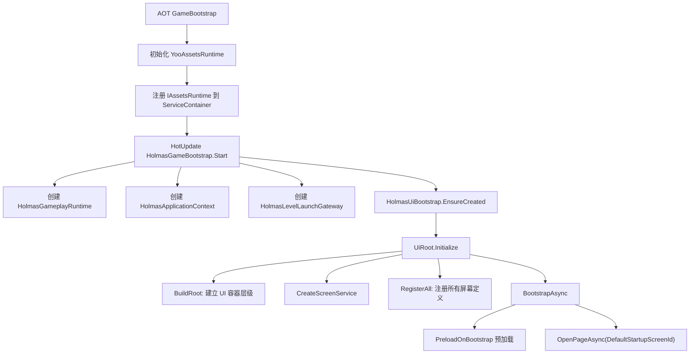

# Holmas 现有 Prefab UI 接入运行时框架方案

## 文档定位

这份文档固定描述 Holmas 当前阶段的正式 UI 接入路线。

它只回答下面这件事：

- 在暂时不把 `UI 自动生成` 作为默认主线的前提下，怎样把已经存在的 `3` 个 prefab 资源界面，稳定接进 Holmas 的正式运行时框架，并尽快支撑业务逻辑落地和可玩主流程。

这份文档适用于当前这条主线：

- 现有 prefab 先接入
- 先把主城 -> 进关 -> 战斗 -> 返回主城 跑通
- UI 只做表现、交互转发和页面编排
- 业务规则继续留在 `App.HotUpdate/Holmas/Application / Board / Tasks / Progression`

这不是：

- UI 自动生成系统正文
- prefab 识别或图片还原方案
- 玩法公式设计文档
- 持久化方案文档

如果后续重新回到 `UiPrefabGenerator` 主线，这份文档依然有效，因为它描述的是 Holmas 业务侧正式 UI 的消费和接入方式，不依赖某一种 prefab 生产来源。

## 完成情况

- 当前状态：进行中
- 进度说明：正式 UI 运行时骨架已经成立，`UiRoot / UiScreenService / UiNavigationState / IUiPrefabLoader` 已可工作；`AgencyMain` 已证明“prefab + controller + presenter + view + bindings”这条正式链路可跑，但当前业务主线还没有切到现有 `MainPanel / BattlePanel / LoadingPanel`。
- 已完成：
  - `App.AOT` 已注册 `IAssetsRuntime`，正式资源可通过 YooAssets 统一加载
  - `HolmasGameBootstrap` 已完成 `HolmasApplicationContext`、`HolmasGameplayRuntime`、`HolmasLevelLaunchGateway` 和 `HolmasUiBootstrap` 接线
  - `UiRoot` 已固定页面层、弹窗层、Sheet 层、Overlay 层和输入阻断层
  - `UiScreenService` 已支持 `Page / Popup / Sheet / Overlay` 四类界面语义
  - `AgencyMain` 已提供一套可运行的样板实现
- 待完成：
  - 将 `MainPanel.prefab` 接成正式启动页
  - 将 `BattlePanel.prefab` 接成正式战斗页
  - 将 `LoadingPanel.prefab` 接成正式加载遮罩
  - 打通 `Main -> Loading -> Battle -> Back -> Main` 的最小玩家闭环
  - 再继续补任务领奖、宣传升级、更多主城控件接线

## 当前适用范围

当前明确纳入这份文档范围的 prefab 只有：

- `Assets/Res/Perfabs/UI/MainPanel.prefab`
- `Assets/Res/Perfabs/UI/BattlePanel.prefab`
- `Assets/Res/Perfabs/UI/LoadingPanel.prefab`

当前推荐职责划分固定为：

- `MainPanel`
  - 主城 / 侦探社主页面
  - 显示玩家等级、金币、任务摘要、宣传入口、开始找猫入口
- `BattlePanel`
  - 战斗页面
  - 显示当前棋盘、战斗 HUD、返回按钮、战斗中状态
- `LoadingPanel`
  - 全局加载遮罩
  - 只负责转场与加载反馈，不进入页面历史栈

## 目标与非目标

### 目标

- 尽快把现有 prefab 资源接进正式运行时，而不是继续卡在 prefab 生产流程
- 保持 `AOT / Shared / HotUpdate` 边界不被 UI 侵蚀
- 保持正式运行时资源统一走 `IAssetsRuntime`
- 保持 UI 层只消费运行时状态，不承载玩法规则
- 保持界面生命周期、层级和返回规则由统一框架维护
- 让后续每个具体页面都能按统一模板持续扩展

### 非目标

- 本阶段不把 `UiPrefabGenerator` 当作默认前提
- 本阶段不先补完整的 popup / sheet / overlay 业务矩阵
- 本阶段不优先补复杂转场动画、对象池和 UI 特效系统
- 本阶段不在 UI 中实现地图生成、任务生成、奖励计算或存档逻辑
- 本阶段不要求 `MainPanel` 上所有按钮一次性全部接完

## 固定边界

### `App.AOT`

只负责：

- 启动宿主
- 初始化 YooAssets / HybridCLR
- 注册 `IAssetsRuntime`
- 提供平台和基础设施接口

不负责：

- 战斗规则
- 页面业务逻辑
- 界面跳转规则

### `App.Shared`

只负责：

- 最小稳定接口
- DTO
- 跨层事件

### `App.HotUpdate`

负责：

- Holmas gameplay runtime
- 页面控制器
- Presenter / ViewModel
- 页面间流程编排
- 调用应用服务并刷新 UI

### UI 层

只负责：

- 资源界面实例化
- 控件绑定
- 输入转发
- 页面刷新
- 导航和层级编排

不负责：

- 奖励公式
- 任务生成
- 棋盘生成
- 长期进度权威写入

## 模块总览

当前正式链路可以按下面理解：



### 宿主启动层

- `Assets/Scripts/App.AOT/Bootstrap/GameBootstrap.cs`
- `Assets/Scripts/App.AOT/YooRuntimeAssets/YooAssetsRuntime.cs`

职责：

- 初始化资源系统
- 注册 `IAssetsRuntime`
- 完成 HotUpdate 环境准备

### Holmas 业务装配层

- `Assets/HotUpdateContent/Script/App.HotUpdate/Holmas/Bootstrap/HolmasGameBootstrap.cs`
- `Assets/HotUpdateContent/Script/App.HotUpdate/Holmas/Application/HolmasApplicationContext.cs`
- `Assets/HotUpdateContent/Script/App.HotUpdate/Holmas/Application/HolmasLevelLaunchGateway.cs`
- `Assets/HotUpdateContent/Script/App.HotUpdate/Holmas/Application/HolmasGameplayRuntime.cs`

职责：

- 加载正式配置
- 建立 gameplay runtime
- 为 UI 提供统一应用上下文和关卡启动门面

### UI 框架层

- `Assets/HotUpdateContent/Script/App.HotUpdate/Holmas/UI/Core/UiRoot.cs`
- `Assets/HotUpdateContent/Script/App.HotUpdate/Holmas/UI/Core/UiScreenService.cs`
- `Assets/HotUpdateContent/Script/App.HotUpdate/Holmas/UI/Core/UiNavigationState.cs`
- `Assets/HotUpdateContent/Script/App.HotUpdate/Holmas/UI/Core/IUiPrefabLoader.cs`
- `Assets/HotUpdateContent/Script/App.HotUpdate/Holmas/UI/Core/UiAssetsPrefabLoader.cs`

职责：

- 统一加载界面 prefab
- 统一打开和关闭界面
- 统一维护层级、历史栈和输入锁

### 具体页面层

每个页面目录固定建议包含：

- `XxxScreenRegistration`
- `XxxPageController` 或 `XxxOverlayController`
- `XxxPresenter`
- `XxxView`
- `XxxBindings`
- `XxxVm`

## 端到端运行时流程

### 1. 资源系统准备

启动阶段先由 AOT 初始化 `YooAssetsRuntime`，并注册成 `IAssetsRuntime`。

这一步结束后，HotUpdate 层不直接依赖 YooAssets 具体实现，只依赖共享接口：

- `IAssetHandle`
- `IAssetsRuntime`

这意味着：

- UI prefab 加载
- 地图模板加载
- 后续图标、音效、运行时资源加载

都应该通过 `IAssetsRuntime` 进入。

### 2. Holmas 业务装配

`HolmasGameBootstrap.Start(serviceContainer)` 会：

1. 从容器取出 `IAssetsRuntime / IAppLogger / ITickManager / IEventBus`
2. 加载正式导出配置
3. 创建 `HolmasGameplayRuntime`
4. 创建 `HolmasApplicationContext`
5. 创建 `HolmasLevelLaunchGateway`
6. 调用 `HolmasUiBootstrap.EnsureCreated(Context, levelLaunchGateway)`

从这一步开始，UI 层已经能拿到：

- 当前玩家等级
- 当前侦探社阶段
- 当前金币
- 当前任务栏状态
- 当前棋盘运行时
- 启动新关卡的方法

### 3. UiRoot 建立 UI 容器

`UiRoot.Initialize()` 只做三件核心事：

1. 建立 UI 根层级
2. 创建 `UiScreenService`
3. 注册默认 screen 并启动默认页面

它不会写任何具体业务页面逻辑。

### 4. Screen 注册

所有界面先变成 `UiScreenDefinition`，然后统一注册到 `UiScreenService`。

一个 screen definition 至少固定下面信息：

- `Id`
- `AssetAddress`
- `Kind`
- `ControllerType`
- `CachePolicy`

如果没有注册，这个界面就无法被打开。

### 5. 打开界面

打开界面时，统一走：

- `OpenPageAsync(screenId, payload)`
- `OpenPopupAsync(screenId, payload)`
- `OpenSheetAsync(screenId, payload)`
- `ShowOverlayAsync(screenId, payload)`

`UiScreenService` 内部固定流程是：

1. 查找 `UiScreenDefinition`
2. 校验类型是否匹配
3. 必要时加输入锁
4. 调 `IUiPrefabLoader.LoadAsync(assetAddress)`
5. 把 prefab 实例挂到对应层级
6. 创建 controller
7. 执行 `OnCreate()`
8. 执行 `OnBind()`
9. 执行 `OnOpen(payload)`

### 6. 界面刷新

正式页面刷新固定建议走：

```text
Controller
-> 调 Presenter.Build(...)
-> 得到 ViewModel
-> 调 View.Render(vm)
-> 只更新控件显示
```

这样做的好处是：

- 页面刷新可重入
- 页面恢复时可重新渲染
- UI 不直接持有复杂业务规则

## UI 层级规则

`UiRoot` 当前维护的层级结构固定如下：

```text
UiRoot(Canvas)
├── UnsafeBackgroundLayer
├── SafeAreaRoot
│   ├── PageLayer
│   ├── SheetLayer
│   └── OverlayLayer
├── PopupBackdrop
├── PopupLayer
├── DebugLayer
└── InputBlocker
```

### 各层职责

- `UnsafeBackgroundLayer`
  - 放超出安全区的背景填充
- `SafeAreaRoot`
  - 放受安全区约束的正式 UI
- `PageLayer`
  - 主页面
- `PopupLayer`
  - 模态弹窗
- `PopupBackdrop`
  - 弹窗背后的半透明遮罩
- `SheetLayer`
  - 页面内部切换组
- `OverlayLayer`
  - loading、toast、引导遮罩
- `DebugLayer`
  - 调试辅助显示
- `InputBlocker`
  - 转场期间的输入阻断

### 层级高低固定理解

一般显示优先级固定为：

1. `Page`
2. `Sheet`
3. `Overlay`
4. `PopupBackdrop`
5. `Popup`
6. `InputBlocker`

也就是说：

- `Overlay` 可以盖在页面上，但不应该代替 popup
- `Popup` 永远在页面和 overlay 之上
- 输入锁在最上层，只在需要时短暂启用

## 导航规则

### `Page`

`Page` 表示主流程页面。

规则固定为：

- 打开新 page 时，旧 page 进入 `Pause`
- 新 page 进入页面栈顶部
- 关闭当前 page 时，恢复上一个 page

当前建议：

- `MainPanel` 是 `Page`
- `BattlePanel` 也是 `Page`

### `Popup`

`Popup` 表示模态弹窗。

规则固定为：

- 进入独立 popup 栈
- 不进入 page 历史栈
- 可选 `ClickOutsideToClose`
- 自动控制 `PopupBackdrop`

### `Sheet`

`Sheet` 表示同一页面中的局部切换组。

规则固定为：

- 同一个 `SheetGroupId` 下只允许一个激活项
- 打开新 sheet 时，旧 sheet 会被关闭

### `Overlay`

`Overlay` 表示全局覆盖层。

典型用途：

- loading
- toast
- 引导遮罩

规则固定为：

- 不进入 page 历史栈
- 同时只保留一个当前 overlay

当前建议：

- `LoadingPanel` 应作为 `Overlay`

### Back 规则

`BackAsync()` 的处理顺序固定为：

1. 先关顶部 popup
2. 再关当前 overlay
3. 最后关当前 page

这个顺序不要在具体页面里各写一套。

## prefab 与控件绑定规则

### 正式推荐方式

正式页面应优先使用：

- `UiReferenceCollector`
- `UiBindingResolver`
- `XxxBindings`

也就是：

1. prefab 上显式挂 `UiReferenceCollector`
2. 把关键控件记录成 `binding_key + node_path + event_name`
3. 页面运行时通过 `Bindings.Resolve(resolver)` 拿控件

这样做的好处是：

- prefab 改动后接线更稳定
- controller 不需要到处写 `transform.Find`
- 每个页面需要哪些控件一眼能看清

### 当前阶段的务实策略

对现有 `MainPanel / BattlePanel / LoadingPanel`，建议分两步：

1. 先跑通：
   - 如果当前 prefab 还没有 collector，允许先加 `View` 层最小兼容查找
2. 再正式化：
   - 把关键控件补进 `UiReferenceCollector + Bindings`

也就是说：

- 临时兼容查找可以作为过渡
- 正式收口仍然应回到显式 bindings

### 控件接线的标准职责分工

`Bindings`

- 只声明页面要用哪些控件
- 只负责把控件从 resolver 中拿出来

`View`

- 只负责：
  - `Bind(bindings)`
  - `Render(vm)`
  - `SetXxxAction(...)`

`Presenter`

- 只负责把应用状态转成 `Vm`

`Controller`

- 只负责：
  - 生命周期
  - 事件接线
  - 调应用服务
  - 刷新页面

## 具体页面推荐写法

### `MainPanel`

推荐目录：

```text
Assets/HotUpdateContent/Script/App.HotUpdate/Holmas/UI/Screens/Main
```

推荐文件：

- `MainScreenRegistration.cs`
- `MainPageController.cs`
- `MainPresenter.cs`
- `MainView.cs`
- `MainBindings.cs`
- `MainVm.cs`

`MainPanel` 当前最小必须接的内容：

- 玩家等级
- 金币
- 当前任务摘要
- 一个“开始找猫”按钮
- 一个或若干宣传升级入口

按钮点击推荐走向：

- `开始找猫`
  - `ShowOverlayAsync("loading.overlay")`
  - `levelLaunchGateway.StartLevelForCurrentPlayerAsync(...)`
  - `OpenPageAsync("battle.main")`
  - `CloseAsync("loading.overlay")`

### `BattlePanel`

推荐目录：

```text
Assets/HotUpdateContent/Script/App.HotUpdate/Holmas/UI/Screens/Battle
```

推荐文件：

- `BattleScreenRegistration.cs`
- `BattlePageController.cs`
- `BattlePresenter.cs`
- `BattleView.cs`
- `BattleBindings.cs`
- `BattleVm.cs`

`BattlePanel` 当前最小必须接的内容：

- 返回按钮
- 当前关卡摘要
- 棋盘容器
- 棋盘格子点击逻辑

正式数据来源固定为：

- `Root.Context.GameplayRuntime.CurrentBoardRuntime`

建议规则：

- 棋盘渲染是 UI 层职责
- `RevealCell / ToggleFlag / 关卡完成推进` 仍由 runtime 提供

### `LoadingPanel`

推荐目录：

```text
Assets/HotUpdateContent/Script/App.HotUpdate/Holmas/UI/Screens/Loading
```

推荐文件：

- `LoadingScreenRegistration.cs`
- `LoadingOverlayController.cs`
- `LoadingView.cs`
- `LoadingBindings.cs`
- `LoadingVm.cs`

`LoadingPanel` 推荐语义：

- `UiScreenKind.Overlay`
- `CachePolicy = KeepInstance`

它只负责：

- 显示加载状态
- 阻止用户在转场时误触

它不负责：

- 启动关卡
- 决定跳去哪页

## 当前 3 个 prefab 的落地顺序

当前推荐严格按下面顺序推进：

### 第 1 步：把 3 个 prefab 注册成正式 screen

先完成：

- `MainPanel -> Page`
- `BattlePanel -> Page`
- `LoadingPanel -> Overlay`

并把默认启动页改成 `MainPanel`。

### 第 2 步：先跑通主流程闭环

优先打通：

`Main -> Loading -> Battle -> Back -> Main`

这一步通过后，Holmas 就具备“从正式 UI 进入可玩状态”的主链。

### 第 3 步：补 BattlePanel 的棋盘交互桥

固定原则：

- 视图生成和刷新在 `BattleView`
- 点击格子后由 `BattlePageController` 调 `GameplayRuntime`
- 业务结果再回刷到 `BattleView`

### 第 4 步：回到 MainPanel 补业务控件

按价值从高到低继续接：

1. 任务摘要和领奖入口
2. 宣传升级入口
3. 其余装饰性或次级入口

### 第 5 步：再考虑 popup / sheet 扩展

只有在主链稳定后，才继续扩：

- 领奖弹窗
- 离线收益弹窗
- 主城局部 sheet

## 建议文件落点

当前建议新增页面代码只写在：

```text
Assets/HotUpdateContent/Script/App.HotUpdate/Holmas/UI/Screens/Main
Assets/HotUpdateContent/Script/App.HotUpdate/Holmas/UI/Screens/Battle
Assets/HotUpdateContent/Script/App.HotUpdate/Holmas/UI/Screens/Loading
```

不要把具体页面逻辑散落到：

- `HolmasUiRoot`
- `HolmasUiPresenter`
- `UiRoot`
- `UiScreenService`

这些位置只保留框架和兼容壳职责。

## 一页界面的标准落地清单

每接一个正式页面，按下面清单执行：

1. 先确定它是 `Page / Popup / Sheet / Overlay` 哪一种
2. 写 `ScreenRegistration`
3. 写 `Controller`
4. 写 `Presenter`
5. 写 `View`
6. 写 `Bindings`
7. 把 prefab 接到 `UiReferenceCollector`
8. 在 `HolmasUiScreenCatalog.RegisterAll()` 中注册
9. 打开界面验证 `Open / Close / Resume / Back`
10. 再补页面内业务控件

## 代码模板建议

最小 screen registration 建议形态：

```csharp
public static class MainScreenRegistration
{
    public const string ScreenId = "main.page";

    public static UiScreenDefinition CreateDefinition()
    {
        return new UiScreenDefinition(
            ScreenId,
            "Assets/Res/Perfabs/UI/MainPanel.prefab",
            UiScreenKind.Page,
            typeof(MainPageController))
        {
            CachePolicy = UiCachePolicy.KeepInstance,
            BlockInputDuringTransition = true,
            PreloadOnBootstrap = true,
        };
    }
}
```

最小 controller 建议形态：

```csharp
public sealed class MainPageController : UiPageController
{
    private MainPresenter _presenter;
    private MainView _view;
    private MainBindings _bindings;

    protected override void OnCreate()
    {
        _presenter = new MainPresenter(Root.Context);
        _view = RootObject.GetComponent<MainView>() ?? RootObject.AddComponent<MainView>();
    }

    protected override void OnBind()
    {
        _bindings = MainBindings.Resolve(BindingResolver);
        _view.Bind(_bindings);
        _view.SetStartAction(OnStartClicked);
    }

    protected override void OnOpen(object payload)
    {
        Refresh();
    }

    private void Refresh()
    {
        MainVm vm = _presenter.Build();
        _view.Render(vm);
    }
}
```

## 当前推荐玩家主流程

当前推荐先冻结下面这条玩家主流程：

```mermaid
flowchart LR
    A["启动游戏"] --> B["HolmasGameBootstrap.Start"]
    B --> C["UiRoot 打开 MainPanel"]
    C --> D["玩家点击开始找猫"]
    D --> E["显示 LoadingPanel(Overlay)"]
    E --> F["HolmasLevelLaunchGateway.StartLevelForCurrentPlayerAsync"]
    F --> G["GameplayRuntime 生成并持有 CurrentBoardRuntime"]
    G --> H["打开 BattlePanel"]
    H --> I["关闭 LoadingPanel"]
    I --> J["玩家进行翻格和标旗"]
    J --> K["战斗结束或返回"]
    K --> L["回到 MainPanel"]
```



## 验证清单

每完成一个阶段，至少验证：

- 默认启动页是否能稳定打开
- 资源地址错误时是否有明确报错或 placeholder 回退
- `BackAsync()` 是否符合 page / popup / overlay 规则
- 打开新 page 时旧 page 是否正确 `Pause`
- 关闭当前 page 时上一个 page 是否正确 `Resume`
- `LoadingPanel` 是否不会误进 page 栈
- 关键按钮是否只调用应用服务，不直接写业务规则
- `BattlePanel` 是否只消费 `CurrentBoardRuntime`，不自己造棋盘权威数据

## 当前阶段明确不做的事

为了尽快把游戏跑起来，当前阶段明确不先做：

- 把 `MainPanel / BattlePanel / LoadingPanel` 重新走一遍自动生成
- 为所有控件一次性补齐最完美的 binding manifest
- 先做大量 popup/sheet 页面
- 先做完整的特效和转场系统

## 结论

当前 Holmas UI 主线的最优先级，不是“继续把 prefab 生产流程做得更完整”，而是“把现有 prefab 正式接入运行时框架，并尽快把业务主流程跑通”。

固定执行顺序就是：

1. 先注册 `Main / Battle / Loading`
2. 再跑通 `Main -> Battle -> Main`
3. 再补战斗交互
4. 最后补主城剩余业务入口

只要这条顺序不乱，后续无论 prefab 来源是手工还是自动生成，Holmas 都能继续沿着同一套正式 UI 运行时收口。
